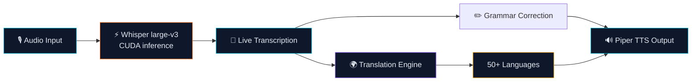
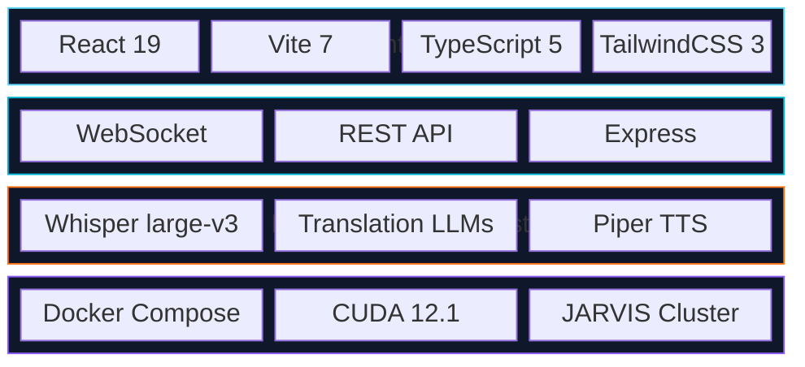

<div align="center">

  <h1>Lumen</h1>
  <p><strong>Live multilingual transcription &mdash; 50+ languages in real-time</strong></p>

  <br/>

  [](LICENSE)
  [](https://reactjs.org)
  [](https://www.typescriptlang.org)
  [](https://vitejs.dev)
  [](https://github.com/openai/whisper)
  [](https://tailwindcss.com)
  [](#)
  [](#)
  [](#supported-languages)
  [](#)
  [](https://github.com/Turbo31150/jarvis-linux)
  [](https://github.com/Turbo31150/lumen/actions/workflows/ci.yml)

  <br/><br/>
  <p><em>A React 19 web app designed to work in tandem with the JARVIS local AI cluster &mdash; centralizing everything a professional or learner needs to work in any language, in real time.</em></p>

  [**Features**](#features) &bull; [**Workspaces**](#workspace-modes) &bull; [**Quick Start**](#quick-start) &bull; [**Tech Stack**](#tech-stack) &bull; [**API**](#api-reference) &bull; [**Ecosystem**](#jarvis-ecosystem)
</div>

---

## Overview

**Lumen** bridges the gap between humans and languages. It captures your microphone input, transcribes it live with Whisper large-v3, translates it across 50+ languages in real-time, applies contextual grammar corrections, and speaks the result back &mdash; all in a single responsive interface.

Built for the **JARVIS** cluster, it leverages local AI inference for privacy and speed.

---

## Pipeline



---

## Workspace Modes

Lumen ships with **5 specialized workspace modes**, each tailored to a different workflow:

| Mode | Description | Use Case |
|:-----|:------------|:---------|
| **LIVE** | Real-time mic transcription with instant display | Meetings, lectures, live captioning |
| **TRANSLATE STUDIO** | Side-by-side source/target with multi-language output | Document translation, language learning |
| **CLUSTER** | JARVIS cluster node monitoring with AI model status | Infrastructure oversight, GPU utilization |
| **OPS DECK** | System operations dashboard with health metrics | DevOps monitoring, service management |
| **HISTORY** | Searchable archive of all past transcription sessions | Review, export, audit trail |

---

## Features

| Feature | Description | Tech |
|---------|-------------|------|
| **Live Transcription** | Mic capture with WhisperFlow (Whisper large-v3) &mdash; low-latency streaming | Whisper + WebSocket |
| **Simultaneous Translation** | Multi-language real-time translation powered by JARVIS AI models | LLM Inference |
| **Grammar Correction** | Contextual AI-powered grammar and style suggestions | NLP Pipeline |
| **Voice Synthesis** | High-fidelity TTS via Piper &mdash; natural-sounding output | Piper TTS |
| **Responsive UI** | Modern React 19 interface &mdash; works on desktop, tablet, and mobile | React 19 + Tailwind |
| **WebSocket Streaming** | Real-time bidirectional communication for instant feedback | ws + Express |
| **Docker Deployment** | One-command deployment with docker-compose | Docker Compose |
| **Language Detection** | Automatic source language identification | Whisper built-in |

---

## Tech Stack



| Layer | Technologies |
|:------|:-------------|
| **Frontend** | React 19, Vite 7, TypeScript 5, TailwindCSS 3 |
| **Transport** | WebSocket (bidirectional audio/text), REST API, Express |
| **AI Layer** | Whisper large-v3 (CUDA), Translation models, Piper TTS |
| **Infrastructure** | Docker Compose, JARVIS cluster integration |

---

## Quick Start

### With Docker (recommended)

```bash
git clone https://github.com/Turbo31150/lumen.git
cd lumen
docker-compose up -d
```

Open [http://localhost:3000](http://localhost:3000).

### Manual Setup

```bash
git clone https://github.com/Turbo31150/lumen.git
cd lumen
npm install
npm run dev
```

> Requires a running JARVIS cluster for AI features (transcription, translation, TTS).

---

## Supported Languages

Lumen supports **50+ languages** for transcription and translation via Whisper large-v3:

| Language | Code | Transcription | Translation | TTS |
|----------|------|:---:|:---:|:---:|
| French | `fr` | Yes | Yes | Yes |
| English | `en` | Yes | Yes | Yes |
| Spanish | `es` | Yes | Yes | Yes |
| German | `de` | Yes | Yes | Yes |
| Italian | `it` | Yes | Yes | Yes |
| Portuguese | `pt` | Yes | Yes | Yes |
| Japanese | `ja` | Yes | Yes | Yes |
| Chinese | `zh` | Yes | Yes | Yes |
| Arabic | `ar` | Yes | Yes | Yes |
| Russian | `ru` | Yes | Yes | Yes |
| Korean | `ko` | Yes | Yes | Yes |
| Hindi | `hi` | Yes | Yes | Yes |
| Turkish | `tr` | Yes | Yes | Yes |
| Dutch | `nl` | Yes | Yes | Yes |
| Polish | `pl` | Yes | Yes | Yes |
| + 35 more | ... | Yes | Yes | Partial |

---

## API Reference

| Endpoint | Method | Description |
|----------|--------|-------------|
| `/api/transcribe` | `POST` | Submit audio for transcription |
| `/api/translate` | `POST` | Translate text between languages |
| `/api/grammar` | `POST` | Grammar check and correction |
| `/api/tts` | `POST` | Text-to-speech synthesis |
| `/api/languages` | `GET` | List supported languages |
| `/api/health` | `GET` | Service health check |
| `/ws` | `WS` | Real-time bidirectional stream |

---

## Interface

The Lumen interface provides a clean, single-page experience:

- **Microphone panel** &mdash; tap to record, see live waveform
- **Transcription feed** &mdash; real-time text as you speak
- **Translation output** &mdash; select target language, see instant results
- **Grammar overlay** &mdash; corrections highlighted inline
- **Audio playback** &mdash; listen to the translated/corrected output

---

## JARVIS Ecosystem

Lumen is part of the **JARVIS** distributed AI cluster:

| Project | Description |
|---------|-------------|
| [jarvis-linux](https://github.com/Turbo31150/jarvis-linux) | Distributed Autonomous AI Cluster |
| [TradeOracle](https://github.com/Turbo31150/TradeOracle) | Autonomous Crypto Trading Agent |
| **lumen** | Multilingual Live AI Web App *(this repo)* |
| [jarvis-whisper-flow](https://github.com/Turbo31150/jarvis-whisper-flow) | Real-time CUDA Voice Pipeline |
| [gemini-live-trading-agent](https://github.com/Turbo31150/gemini-live-trading-agent) | Voice Trading Assistant |
| [gemini-creative-storyteller](https://github.com/Turbo31150/gemini-creative-storyteller) | Interactive AI Storyteller |
| [browser-mcp-orchestrator](https://github.com/Turbo31150/browser-mcp-orchestrator) | Dual-Browser DevTools Orchestration |
| [transcription-multi-langue](https://github.com/Turbo31150/transcription-multi-langue) | Lightweight Multilingual Transcription |


## What is LUMEN?

A live multilingual transcription app. Drop into a meeting in any language — LUMEN transcribes in real-time, translates to your language, and keeps a searchable history.

Built with React 19 and powered by Whisper large-v3 on GPU for instant transcription in 50+ languages.

## Use Cases

| Use Case | How |
|----------|-----|
| **International meetings** | Live subtitles in your language while others speak theirs |
| **Content creation** | Auto-transcribe podcasts, videos, interviews |
| **Accessibility** | Real-time captions for hearing-impaired users |
| **Research** | Transcribe lectures, then search by keyword |
| **Language learning** | See translations side-by-side in real-time |

## 5 Workspace Modes

| Mode | Purpose |
|------|---------|
| **LIVE** | Real-time transcription as you speak/listen |
| **TRANSLATE STUDIO** | Batch translate audio files to any language |
| **CLUSTER** | Distribute transcription across GPU cluster for speed |
| **OPS DECK** | Monitor system resources and transcription queue |
| **HISTORY** | Search, export, and manage past transcriptions |

## Example

```
Input:  "Bonjour, aujourd'hui nous allons parler de l'intelligence artificielle"
Output: {
  "original": "Bonjour, aujourd'hui nous allons parler de l'intelligence artificielle",
  "language": "fr",
  "translations": {
    "en": "Hello, today we will talk about artificial intelligence",
    "ja": "こんにちは、今日は人工知能について話します",
    "ar": "مرحبا، سنتحدث اليوم عن الذكاء الاصطناعي"
  },
  "confidence": 0.97,
  "duration": "0.8s"
}
```


---

## License

MIT (c) 2026 [Turbo31150](https://github.com/Turbo31150) &mdash; Franck Delmas

> Freelance profile: [codeur.com/-6666zlkh](https://www.codeur.com/-6666zlkh)
